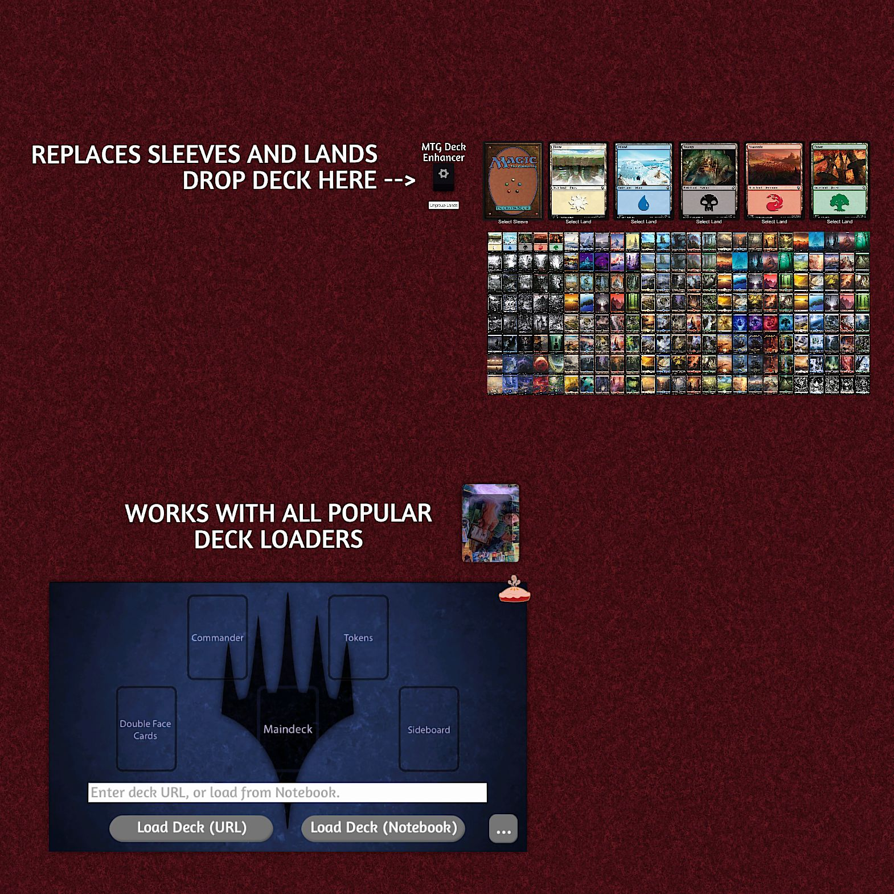

# Ultimate MTG Deck Enhancement Tool

Add a touch of flair and immersion to your MTG games with this all-in-one mod bundle!  
Transform your deck with card sleeves from MTG Arena and full-art land cards—instantly upgrading your game with rich, authentic visuals.

---

## ✨ Tools

- **Sleeve Changer** – Bring custom sleeves into your own decks.
- **Land Swapper** – With 600+ full-art lands, show off your deck with gorgeous lands from every major MTG expansion.
- **Deck Sorter** - View the deck while selecting sorting options.
---

## 🎮 Features

- **Automatic Save** – Your configuration, sleeve, and land selections are remembered between sessions.
- **Easy Customization** – Simply choose your options, then drop a deck onto the tool.
- **Fast and Convenient** – Subscribe and open; everything loads ready to play—no extra setup needed.
- **Low Complexity** – Ideal for both casual players and experienced deckbuilders looking for a visual upgrade.

---

## 🔗 Compatible Mods

Seamless integration with MTG Table importers:

- [Chat Importer by Amuzet](https://steamcommunity.com/sharedfiles/filedetails/?id=1838051922)
- [Playmat Importer by Omes](https://steamcommunity.com/sharedfiles/filedetails/?id=2163084841)
- [Deck Importer by rikrassen](https://steamcommunity.com/sharedfiles/filedetails/?id=2265064081)

---

## 🙌 Credits & Thanks

**Built with passion and inspired by:**

- [Every Card Sleeves from MTG Arena by Malixx](https://steamcommunity.com/sharedfiles/filedetails/?id=2690150731)
- [Every Full-Art Lands from Magic: The Gathering by Malixx](https://steamcommunity.com/sharedfiles/filedetails/?id=2676515743)

A big **thank you** for the amazing art and tools – without these contributions, this mod wouldn't exist.

---

## 📚 Resources

- [Assets and a copy of the savegame on GitHub](https://github.com/cornernote/tabletop_simulator-mtg_deck_enhancer)
- [Game on Tabletop Simulator Steam Workshop](https://steamcommunity.com/sharedfiles/filedetails/?id=3558079503)

---
